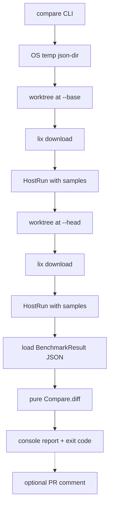

# Compare & sampled measures — design and implementation

Self-contained design / impl guide for later agents. **This file is the source of truth.** Do not invent HostReporter / IPC; results reach the host only via JSON on disk.

---

## Goals

1. **Sampled measures** — After warmup, `Measure.run` executes **N** independent timed loops, fills `MeasureResult.samples`, and sets `duration` to the **mean** of those samples.
2. **Host `run --samples`** — Host CLI controls N (default **5**) and injects it into the guest suite.
3. **Host `compare`** — Run the same suite at two git SHAs (`--base`, `--head`), load JSON from an **OS-temp** `json-dir` that compare creates (not a user `--json-dir` flag), diff mean ops/sec, flag major improvements / degradations.
4. **Optional** — Post the comparison summary to a GitHub PR when requested (flag-gated).

## Non-goals

- **No HostReporter**, sockets, or other IPC for result handoff (explicitly dropped).
- No replacement of the HTML longitudinal viewer; compare is an automated two-commit verdict.
- v1 compare does **not** use sample variance / statistical tests — only mean `duration` → ops/sec. Samples are stored for reporters and future work. (README must carry a **TODO** for a future noise model — see Chunk 5.)
- No force-push, rebase, or mutation of the consumer’s primary working tree beyond temporary worktrees.

---

## Locked decisions (Chunk 0)

Implementing agents must follow these without re-opening them:

| Decision | Locked choice |
| --- | --- |
| Sample count default | **5** on `Measure.run` when omitted, and on host `--samples` |
| Time budget default | **`targetMs` = 150** (lower suite cost under N=5; update `Measure` / `MeasureOptions` / README together) |
| Options field name | `MeasureOptions.sampleCount`; result field remains `samples` |
| Host → guest injection | Top-level `sampleCount` on `BenchkitConfig` inside `WHY_BENCHKIT_CONFIG` (same JSON for browser inject) |
| Precedence | Explicit `MeasureOptions.sampleCount` (incl. suite/macro opts) **>** host `BenchkitConfig.sampleCount` **>** default `5` |
| Compare temp `json-dir` | **OS temp only** (e.g. `$TMPDIR` / `TEMP` + unique name), **outside** the repo and both worktrees — never project-local `.why-benchkit/…` |
| Missed cleanup mitigation | Prefer `try/finally` remove; if process dies via `Sys.exit` / crash, OS temp reclamation is the safety net. Still remove worktrees best-effort. |
| JSON folder after each SHA run | Must be `<json-dir>/<full-sha>/…`. **Fail** if `HostGit.resolveOutput` yields `_dirty` or `folderId !=` resolved full SHA |
| Worktree cwd | Run each SHA with cwd = that worktree (clean detached checkout) |
| Worktree deps | After `git worktree add`, run **`lix download`** in the worktree before `HostRun`. README **TODO**: allow customizing the install command later |
| Noise / CI statistics | v1 keeps mean ± threshold only. README **TODO**: noise model / variance / median (no impl in v1) |
| Pure compare module | `why.benchkit.Compare` (or `src/why/benchkit/Compare.hx`) — **not** under `host/`; host only loads JSON and prints |
| HostRun / exit | Prefer shared runner that **returns a status** so compare can run base then head and clean up; CLI commands own final `Sys.exit`. OS temp mitigates leaked json-dirs if exit still skips `finally` |
| Zero paired measures | Non-zero exit (or hard fail) when no measures align — likely haxeVersion / rename miss |
| `--post-pr-comment` failure | **Warn only**; never override degradation-driven exit code |
| Chunk 4 split | **4a** HostRun returns status · **4b** run-at-SHA + OS temp · **4c** compare CLI / table / exit policy |

---

## Architecture



**Result path:** `compare` creates an **OS temp** folder, passes it as `json-dir` into existing run orchestration (per SHA, from a clean worktree), then reads `<tmp>/<full-sha>/<haxeVer>/<target>.json`. Delete the temp tree in `try/finally` when possible; OS temp is the fallback if the process exits hard.

---

## Samples design

### Semantics

| Field | Meaning after sampled run |
| --- | --- |
| `warmup` | Untimed iterations run **once** before sampling |
| `iterations` | Timed iterations **per sample** (same for every sample) |
| `samples` | `Array<Millisecond>`, length **N** (≥ 1); each entry is one full timed loop |
| `duration` | **Mean** of `samples` (headline for reporters / charts / compare) |

### `Measure.run` behavior

1. Resolve warmup (adaptive or fixed) — unchanged; still once.
2. Resolve `iterations` for one timed loop (fixed or time-budgeted calibration) — calibrate **once**, reuse that count for every sample.
3. Run the timed loop **N** times → collect `samples`.
4. Return `duration = mean(samples)`, `samples` always present when N ≥ 1.

Default **N = 5** when the host / options omit an explicit count. Reject N &lt; 1.

Default **`targetMs` = 150** when time-budgeted calibration is used (was higher historically; lowered so N=5 stays affordable).

Calibration probes are untimed extras before the sample loop; note in Chunk 1 comments that sample\[0\] may see residual JIT/GC effects (no discard in v1).

### Plumbing

| Layer | Mechanism |
| --- | --- |
| API | `MeasureOptions.sampleCount`; result field `samples` |
| Suite / Runner | Pass through from measure metas / runner defaults so host-injected config reaches each `Measure.run` |
| Host | `--samples <n>` on `run` and `compare`; inject top-level `sampleCount` on `BenchkitConfig` via `WHY_BENCHKIT_CONFIG` |
| Precedence | Explicit `sampleCount` on measure opts **>** host config **>** `5` |
| JSON | `JsonReporter` already serializes `MeasureResult`; ensure `samples` is written when present |
| Console / HTML | Keep using `duration` (mean). Optional later: print sample spread — not required for v1 |

### Locked defaults

- Default sample count: **5**
- Default `targetMs`: **150**
- Aggregate: **arithmetic mean**
- Calibration (time-budgeted `iterations`): once before the sample loop, not per sample

---

## CLI contract

### `why-benchkit run`

Existing flags, plus:

| Flag | Default | Notes |
| --- | --- | --- |
| `--samples <n>` | `5` | Independent timed loops after warmup |

Example:

```bash
why-benchkit run --targets node,js --json-dir out --samples 5
```

### `why-benchkit compare`

| Flag | Required | Default | Notes |
| --- | --- | --- | --- |
| `--base <sha>` | yes | — | Baseline commit (full or unambiguous short SHA / ref resolved to SHA) |
| `--head <sha>` | yes | — | Candidate commit |
| `--targets …` | yes | — | Same as `run` |
| `--samples <n>` | no | `5` | Passed through to both runs |
| `--threshold <f>` | no | `0.10` | Relative ops/sec delta for “major” (≥ 10%) |
| `--fail-on-missing` | no | off | Non-zero exit if any measure exists on only one side |
| `--post-pr-comment` | no | off | Chunk 6 only |

`compare` **creates** its own OS-temp `json-dir`; do not require the user to pass `--json-dir` for compare.

Examples:

```bash
why-benchkit compare --base abc1234 --head def5678 --targets node
why-benchkit compare --base origin/main --head HEAD --targets node,js --samples 7 --threshold 0.15
```

### Exit codes (`compare`)

| Code | When |
| --- | --- |
| `0` | No major **degradations** (improvements / unchanged OK); at least one paired measure |
| `1` | At least one major degradation, orchestration / load failure, `_dirty` / SHA folder mismatch, or **zero paired measures** |
| `1` | Also if `--fail-on-missing` and any missing-side pairs |

Always print missing-side counts. With `--fail-on-missing` off, missing sides do not alone fail (except the zero-paired case above).

---

## Comparison data model

### Identity key

Align measures across base and head by:

`(haxeVersion, target, suiteName, measureName)`

`target` is the CLI/host target string used in the JSON filename / config (same as today’s nested layout).

If base/head resolve different `haxeVersion` values, keys will not pair — treat zero paired measures as failure (see Locked decisions).

### Metric

```
opsPerSec = iterations / (durationMs / 1000)
```

Use mean `duration` from each side. Higher ops/sec is better.

### Relative delta

```
delta = (headOps - baseOps) / baseOps
```

| Condition | Verdict |
| --- | --- |
| measure only on base | `missing_head` |
| measure only on head | `missing_base` |
| `delta >= +threshold` | `improved` |
| `delta <= -threshold` | `degraded` |
| otherwise | `unchanged` |

### Suggested types (pure module)

Place under `why.benchkit` (not `host`):

```haxe
enum abstract CompareVerdict(String) {
  var Improved = 'improved';
  var Degraded = 'degraded';
  var Unchanged = 'unchanged';
  var MissingBase = 'missing_base';
  var MissingHead = 'missing_head';
}

typedef CompareEntry = {
  final haxeVersion:String;
  final target:String;
  final suite:String;
  final measure:String;
  final ?baseOps:Float;
  final ?headOps:Float;
  final ?delta:Float; // relative; null if missing side
  final verdict:CompareVerdict;
}

typedef CompareReport = {
  final base:String;
  final head:String;
  final threshold:Float;
  final entries:Array<CompareEntry>;
}
```

Keep `Compare.diff` / load helpers **pure** (no I/O beyond optional pure parse helpers; filesystem load stays at the host command edge).

---

## Checkout & temp layout

- Resolve `--base` / `--head` to full SHAs via `HostGit` (`rev-parse`, `refExists`).
- Create **OS temp** `json-dir` (pattern like [`HostSync.hx`](src/why/benchkit/host/HostSync.hx) `uniqueTempPath`, e.g. `$TMPDIR/why-benchkit-compare-…`). Must not live inside the consumer repo or either worktree.
- For each SHA:
  1. `git worktree add <osTempWorktreePath> <sha>`
  2. `Sys.setCwd` (or equivalent) to that worktree
  3. Run **`lix download`** in the worktree (fail clearly if `lix` missing / non-zero)
  4. Invoke shared run logic with `json-dir` = compare temp root and `samples` = N
  5. Assert output under `<tmp>/<full-sha>/…` (`folderId ==` full SHA; **not** `_dirty`)
  6. Remove worktree (best-effort)
- Remove temp `json-dir` in `finally` when the stack still unwinds; OS temp is the mitigation if `Sys.exit` skips cleanup.
- Pattern reference: [`HostSync.hx`](src/why/benchkit/host/HostSync.hx) worktree add/remove.

---

## Reuse map

| Piece | Role |
| --- | --- |
| [`Measure.hx`](src/why/benchkit/Measure.hx) | Sample loop; fill `samples`; mean → `duration`; default `targetMs` **150** |
| [`MeasureResult.hx`](src/why/benchkit/MeasureResult.hx) | `samples` field already documented; currently unfilled |
| [`MeasureOptions.hx`](src/why/benchkit/MeasureOptions.hx) | Add `sampleCount`; document `targetMs` default 150 |
| [`Runner.hx`](src/why/benchkit/Runner.hx) / macros | Propagate sample count into each measure |
| [`Config.hx`](src/why/benchkit/Config.hx) / [`BenchkitEnv.hx`](src/why/benchkit/BenchkitEnv.hx) | Host → guest `sampleCount` on `BenchkitConfig` |
| [`HostRun.hx`](src/why/benchkit/host/HostRun.hx) | Multi-target travix + JSON dir; samples; **return status** for compare reuse |
| [`HostRunCommand.hx`](src/why/benchkit/host/HostRunCommand.hx) | `--samples`; owns `Sys.exit` after run |
| [`HostGit.hx`](src/why/benchkit/host/HostGit.hx) | SHA resolve, output paths |
| [`JsonManifest.hx`](src/why/benchkit/host/JsonManifest.hx) | Existing nested JSON layout |
| New `Compare.hx` (package `why.benchkit`) | Pure align / diff / verdicts |
| [`Run.hx`](src/why/benchkit/Run.hx) | Wire `compare` subcommand |
| [`HostSync.hx`](src/why/benchkit/host/HostSync.hx) | Worktree + OS temp path pattern |

JSON tree (unchanged shape):

```text
<json-dir>/manifest.json
<json-dir>/<full-sha>/manifest.json
<json-dir>/<full-sha>/<haxeVersion>/<target>.json
```

---

## Agent work chunks

Each chunk is one agent-sized unit. Complete the checklist, meet acceptance criteria, then fill the **Agent log**.

Shared log template (copy under each chunk):

```markdown
### Agent log

| Field | Value |
| --- | --- |
| Date | |
| Agent / model | |
| Notes | |
| Follow-ups | |
```

---

### Chunk 0 — Spec freeze

**Goal:** Confirm locked decisions before coding. No code changes.

**Depends on:** nothing

**Files:** this document only (read)

#### Checklist

- [x] Re-read Goals / Non-goals (no HostReporter)
- [x] Re-read **Locked decisions** table — treat as frozen
- [x] Confirm flags: `run`/`compare` `--samples` (default 5); `compare` `--base`, `--head`, `--targets`, `--threshold` (0.10)
- [x] Confirm metric: mean ops/sec; major = |delta| ≥ threshold; fail on major degradation
- [x] Confirm `targetMs` default **150**; sample count default **5**
- [x] Confirm OS-temp `json-dir` + filesystem JSON only; fail on `_dirty`
- [x] Confirm worktree + **`lix download`** per SHA
- [x] Confirm Chunk 4 split: 4a / 4b / 4c
- [x] Confirm `--post-pr-comment` failure = warn only
- [x] Agent log **Notes** lists locked decisions verbatim (or “see Locked decisions table”)

#### Acceptance criteria

- Implementing agent can state the locked table without inventing alternate IPC, flag names, temp locations, or install steps.

### Agent log

| Field | Value |
| --- | --- |
| Date | 2026-07-22 |
| Agent / model | Composer (Auto) |
| Notes | Spec freeze complete. Locked decisions treated as frozen — see **Locked decisions (Chunk 0)** table above (verbatim): sample count default **5** on `Measure.run` and host `--samples`; `targetMs` = **150**; options field `MeasureOptions.sampleCount` (result field `samples`); host→guest via top-level `sampleCount` on `BenchkitConfig` in `WHY_BENCHKIT_CONFIG`; precedence explicit measure opts **>** host config **>** 5; compare `json-dir` = **OS temp only** (outside repo/worktrees); cleanup via `try/finally` with OS temp as crash safety net; JSON folder must be `<json-dir>/<full-sha>/…` — **fail** on `_dirty` / SHA mismatch; worktree cwd = clean detached checkout; after `git worktree add` run **`lix download`** (README TODO for custom install later); v1 noise = mean ± threshold only (README TODO for variance/median); pure `why.benchkit.Compare` (not under `host/`); HostRun **returns status**, CLI owns `Sys.exit`; zero paired measures → non-zero exit; `--post-pr-comment` failure = **warn only**; Chunk 4 split **4a** / **4b** / **4c**. No HostReporter / IPC. Flags: `--samples` (5), compare `--base`/`--head`/`--targets`/`--threshold` (0.10). Metric: mean ops/sec; major = \|delta\| ≥ threshold; fail on major degradation. |
| Follow-ups | Next: Chunk 2 — Host `--samples` on `run`. Chunk 1 completed: `DEFAULT_TARGET_MS` / `MeasureOptions` now **150**. README `targetMs` / samples docs landed in Chunk 5. |

---

### Chunk 1 — Sampled `Measure.run`

**Goal:** After warmup, run N timed loops; fill `samples`; `duration` = mean. Align default `targetMs` to **150**.

**Depends on:** Chunk 0

**Files (expected):**

- [`src/why/benchkit/Measure.hx`](src/why/benchkit/Measure.hx)
- [`src/why/benchkit/MeasureOptions.hx`](src/why/benchkit/MeasureOptions.hx)
- [`src/why/benchkit/MeasureResult.hx`](src/why/benchkit/MeasureResult.hx) (docs only if needed)
- Runner / suite path if defaults must flow without host yet
- Tests under `tests/` (extend existing measure smoke)

#### Checklist

- [x] Add `sampleCount` on `MeasureOptions`
- [x] Default N = 5 when omitted
- [x] Reject N &lt; 1 with a clear error
- [x] Change default `targetMs` to **150** (code + `MeasureOptions` docs; fix any “500” / “250” drift)
- [x] Warmup once; calibrate / fix `iterations` once; loop N timed measures
- [x] Set `samples` to the N durations; set `duration` to arithmetic mean
- [x] Keep fixed / adaptive iteration modes working with sampling
- [x] Comment: calibration probes are outside `samples`; no first-sample discard in v1
- [x] Tests: `samples.length == N`; mean of `samples` equals `duration` (within float tolerance)
- [x] Follow [`AGENTS.md`](AGENTS.md): `final`, explicit member types, pure core logic

#### Acceptance criteria

- Calling `Measure.run` without host changes yields populated `samples` and mean `duration`.
- Existing adaptive / fixed matrix still behaves correctly with N &gt; 1.
- Time-budgeted path uses `targetMs` default 150 when omitted.

### Agent log

| Field | Value |
| --- | --- |
| Date | 2026-07-22 |
| Agent / model | Composer (Auto) |
| Notes | Sampled `Measure.run`: warmup once → resolve iterations once (fixed or `calibrateIterations`) → N timed loops; `samples` filled; `duration` = arithmetic mean via `Millisecond` ops. Defaults: `sampleCount` **5**, `targetMs` **150** (`DEFAULT_TARGET_MS` was 250; `MeasureOptions` docs were 500). Rejects `sampleCount < 1`. Calibration probes documented as outside `samples`; no first-sample discard. Smoke extended for default/explicit/budgeted N and mean↔duration; existing matrix tests use `sampleCount: 1` for speed. Host `--samples` / Runner injection left for Chunk 2. README `targetMs` / samples docs landed in Chunk 5. |
| Follow-ups | Chunk 2: host `--samples` + `BenchkitConfig.sampleCount` injection. |
---

### Chunk 2 — Host `--samples` on `run`

**Goal:** Host CLI controls sample count and injects it into the guest suite.

**Depends on:** Chunk 1

**Files (expected):**

- [`src/why/benchkit/host/HostRunCommand.hx`](src/why/benchkit/host/HostRunCommand.hx)
- [`src/why/benchkit/host/HostRun.hx`](src/why/benchkit/host/HostRun.hx)
- [`src/why/benchkit/Config.hx`](src/why/benchkit/Config.hx) and/or [`BenchkitEnv.hx`](src/why/benchkit/BenchkitEnv.hx)
- Runner load path so suite applies host sample count
- Browser inject path for `js` if config shape changes (`.travix/js/hooks.js` only if needed)

#### Checklist

- [x] Add `--samples` to `HostRunCommand` (default 5; validate ≥ 1)
- [x] Thread value into `HostRun.run`
- [x] Inject top-level `sampleCount` on `BenchkitConfig` via `WHY_BENCHKIT_CONFIG`; suite applies to all measures
- [x] Precedence: explicit measure `sampleCount` **>** host config **>** 5 (document in code comment)
- [x] Smoke: `run --targets interp --samples 3` produces JSON (when `--json-dir` set) with `samples.length == 3`

#### Acceptance criteria

- Host can change N without editing suite source.
- Default remains 5 when flag omitted.

### Agent log

| Field | Value |
| --- | --- |
| Date | 2026-07-22 |
| Agent / model | Composer (Cursor agent) |
| Notes | Host `--samples` (default 5, reject &lt; 1) → `HostRun.run` → top-level `BenchkitConfig.sampleCount` in `WHY_BENCHKIT_CONFIG`. `Config.parse` reads/validates it. `Runner` loads config once, `applyHostSampleCount` fills omitted measure opts (explicit opts win). Browser hooks unchanged (passthrough JSON). Verified: JsonSmoke (parse/merge/reject), fixture `run --targets interp --samples 3 --json-dir …` → all measures `samples.length == 3`; omitted flag → N=5; `--samples 0` exits 1. |
| Follow-ups | Chunk 3 (pure Compare) can proceed in parallel; Chunk 4 needs this injection for compare `--samples`. No `@:sampleCount` meta yet — suite explicit override is only via direct `MeasureOptions` / future meta. |

---

### Chunk 3 — Pure compare core

**Goal:** Side-effect-free align / diff / classify on two result trees (or loaded docs).

**Depends on:** Chunk 0 (can parallelize with 1–2 once JSON shape with `duration` is stable; samples not required for v1 math)

**Files (expected):**

- New `src/why/benchkit/Compare.hx` (+ `CompareVerdict` / `CompareEntry` / `CompareReport` / `CompareOptions`)
- Tests: `tests/CompareSmoke.hx` + `compare.hxml`; `check.hxml` lists `why.benchkit.Compare`

#### Checklist

- [x] Implement keying by `(haxeVersion, target, suite, measure)`
- [x] Compute ops/sec from `iterations` + mean `duration`
- [x] Apply threshold → verdicts (`improved` / `degraded` / `unchanged` / missing sides)
- [x] Pure functions only (no git, no travix, no Sys I/O in core)
- [x] Unit/smoke tests for improved, degraded, unchanged, missing base, missing head
- [x] Helper to build `CompareReport` summary lists (e.g. all degraded entries)
- [x] Helper or documented check for “zero paired measures”

#### Acceptance criteria

- Given two in-memory `BenchmarkResult` maps / docs, tests assert expected verdicts without running travix.

### Agent log

| Field | Value |
| --- | --- |
| Date | 2026-07-22 |
| Agent / model | Composer (Cursor agent) |
| Notes | Pure `why.benchkit.Compare`: `diff(baseDocs, headDocs, options)` keys by `(haxeVersion, target, suite, measure)`, ops/sec = `iterations / (durationMs/1000)`, relative delta vs threshold (default **0.10**). Verdicts: improved / degraded / unchanged / missing_base / missing_head. Types split into `CompareVerdict` / `CompareEntry` / `CompareReport` / `CompareOptions`. Summary helpers: `degraded` / `improved` / `unchanged` / `missing` / `entriesWithVerdict`; zero-pair check: `pairedCount` / `hasPairedMeasures` (documented for host exit-1). Callers should set `BenchmarkResult.target` to CLI/host target for identity. Verified via `haxe compare.hxml` (`CompareSmoke`), `haxe check.hxml`. |
| Follow-ups | Chunk 4c must load JSON and rewrite/set `target` to the filename/CLI target before calling `diff`. Chunk 4a/4b still needed for orchestration. |

---

### Chunk 4a — `HostRun` returns status

**Goal:** Extract shared multi-target run that **returns** success/failure instead of always `Sys.exit`, so compare can orchestrate base then head and still attempt cleanup.

**Depends on:** Chunk 2

**Files (expected):**

- [`src/why/benchkit/host/HostRun.hx`](src/why/benchkit/host/HostRun.hx)
- [`src/why/benchkit/host/HostRunStatus.hx`](src/why/benchkit/host/HostRunStatus.hx)
- [`src/why/benchkit/host/HostRunCommand.hx`](src/why/benchkit/host/HostRunCommand.hx) — `Sys.exit` only at command edge
- Smoke: `tests/HostRunSmoke.hx` + `hostrun.hxml`

#### Checklist

- [x] Shared runner returns a status / throws instead of unconditional `Sys.exit(0)` at end
- [x] `HostRunCommand` maps status → process exit
- [x] Document that travix may still `Sys.exit` on toolchain failure (OS-temp json-dir is the leak mitigation)
- [x] Existing `why-benchkit run` behavior unchanged from the user’s POV

#### Acceptance criteria

- Compare (later chunks) can invoke the shared runner twice in one process when travix does not hard-exit.
- `run` CLI still exits with the correct code.

### Agent log

| Field | Value |
| --- | --- |
| Date | 2026-07-22 |
| Agent / model | Composer (Cursor agent) |
| Notes | `HostRun.run` now returns `HostRunStatus` (`Ok=0` / `Failed=1`) instead of `Sys.exit`. Host-side setup failures (missing `bench.hxml`, missing js travix config/hooks) print then `return Failed`. Success `return Ok`. Docs note travix may still hard-exit on toolchain/build failure (OS-temp json-dir is leak mitigation). `HostRunCommand` maps status → `Sys.exit(status)`. Smoke: `haxe hostrun.hxml` — Failed×2 without bench.hxml, then Ok×2 via travix interp on `fixture/foo`. Fixture `run --targets interp` still exits 0. |
| Follow-ups | Chunk 4b: run-at-SHA worktree + OS temp + `lix download`, calling shared `HostRun.run` and checking status. |

---

### Chunk 4b — Run-at-SHA (worktree + OS temp + `lix download`)

**Goal:** Checkout each SHA in an OS-temp worktree, install deps with `lix download`, run suite into a shared OS-temp `json-dir`, assert clean SHA folders.

**Depends on:** Chunk 4a

**Files (expected):**

- New e.g. `src/why/benchkit/host/HostCompare.hx` (orchestration helpers; no full CLI yet)
- Reuse [`HostGit.hx`](src/why/benchkit/host/HostGit.hx) / [`HostSync.hx`](src/why/benchkit/host/HostSync.hx) patterns

#### Checklist

- [x] Resolve SHA to full hash; fail clearly if missing
- [x] Create OS-temp `json-dir` outside repo/worktrees
- [x] `git worktree add` to OS-temp path; cwd = worktree
- [x] Run `lix download` in worktree; fail with actionable message if missing/`lix` errors
- [x] Call shared HostRun with samples + that `json-dir`
- [x] Assert `folderId ==` full SHA (fail on `_dirty`)
- [x] Remove worktree best-effort; delete `json-dir` in `finally` when possible
- [x] Support sequential base then head into the same `json-dir`

#### Acceptance criteria

- Helper can produce `<tmp>/<baseSha>/…` and `<tmp>/<headSha>/…` JSON for a fixture/repo SHA pair without leaving worktrees behind on the happy path.

### Agent log

| Field | Value |
| --- | --- |
| Date | 2026-07-22 |
| Agent / model | Composer (Cursor agent) |
| Notes | Added `HostCompare`: `resolveSha`, `createJsonDir` / `removeJsonDir`, `runAtSha` (detached OS-temp worktree → `lix download` → `HostRun.run` → assert clean `<jsonDir>/<fullSha>/` → best-effort worktree remove), and `withRuns` (base then head into one OS-temp json-dir, callback, then delete json-dir). Actionable errors for bad refs / missing `lix` / non-zero `lix download`. Smoke: `haxe hostcompare.hxml` builds a temp fixture-shaped consumer git repo (root `travix.hxml` is gitignored), runs interp at two SHAs with `samples=1`, asserts both SHA folders and no leftover compare worktrees. |
| Follow-ups | Chunk 4c: `compare` CLI loads JSON from `withRuns` artifacts, pure `Compare.diff`, table + exit policy. Travix may still `Sys.exit` mid-run (OS-temp json-dir / worktree best-effort remain mitigations). |

---

### Chunk 4c — `compare` CLI + report + exit codes

**Goal:** Wire `why-benchkit compare`, load JSON, pure diff, console table, exit policy.

**Depends on:** Chunks 3 and 4b

**Files (expected):**

- New `src/why/benchkit/host/HostCompareCommand.hx`
- [`src/why/benchkit/Run.hx`](src/why/benchkit/Run.hx) — register command
- Orchestration from 4b

#### Checklist

- [x] Flags: `--base`, `--head`, `--targets`, `--samples`, `--threshold`, `--fail-on-missing`
- [x] Call 4b orchestration for both SHAs
- [x] Load JSON for all targets / haxe versions under both SHA folders
- [x] Call pure `Compare` → print human-readable table (suite, measure, base ops, head ops, delta %, verdict)
- [x] Print missing-side counts; exit `1` on any `degraded`, on zero paired measures, on `_dirty`/orchestration failure, and on `--fail-on-missing` when set
- [x] `why-benchkit compare --help` documents flags

#### Acceptance criteria

- On a fixture or this repo with two known SHAs and `--targets interp` (or similar), command prints a report and exits 0/1 per rules.
- Consumer primary cwd / branch unchanged after success or failure.

### Agent log

| Field | Value |
| --- | --- |
| Date | 2026-07-22 |
| Agent / model | Composer (Cursor agent) |
| Notes | `HostCompareCommand` wired in `Run` with `--base`/`--head`/`--targets`/`--samples` (5)/`--threshold` (0.10)/`--fail-on-missing`. Uses `HostCompare.withRuns` + absolute `libraryRoot`. `loadDocs` rewrites `BenchmarkResult.target` from JSON filename (CLI target), not body `eval`. Pure `exitCode` / `formatReport`; exit 1 on degraded, zero pairs, orchestration failure, or fail-on-missing. Verified: `haxe hostcomparecmd.hxml`, extended `hostcompare.hxml` (load+diff+table on fixture SHAs), `compare help` via `--run`. |
| Follow-ups | Chunk 6: `--post-pr-comment` (warn-only). No full CLI E2E via `haxelib run` in this chunk — orchestration covered by HostCompareSmoke. README/docs landed in Chunk 5. |

---

### Chunk 5 — Docs & smoke

**Goal:** Document samples + compare; record smoke steps; add README TODOs for future work.

**Depends on:** Chunk 4c

**Files (expected):**

- [`README.md`](README.md)
- Optionally fixture notes under `fixture/foo/`
- This file: tick any doc-only clarifications discovered during impl

#### Checklist

- [x] README: `MeasureResult.samples` / `--samples` default 5
- [x] README: default `targetMs` **150** (adaptive / time-budgeted)
- [x] README: `compare --base --head --targets` section with exit-code behavior, OS-temp json-dir, worktree + `lix download`
- [x] README **TODO**: allow customizing the per-worktree install command (today hard-coded `lix download`)
- [x] README **TODO**: noise model / statistical comparison (v1 is mean ± threshold only; samples stored for later)
- [x] Note non-goal: no HostReporter
- [x] Smoke steps for local verify (interp or node)
- [x] Mention cleanup / worktree / OS-temp behavior briefly

#### Acceptance criteria

- A new contributor can run compare from README alone.
- Both TODOs are visible in README (not only in this roadmap).

### Agent log

| Field | Value |
| --- | --- |
| Date | 2026-07-22 |
| Agent / model | Composer (Cursor agent) |
| Notes | README: samples N=5 + `targetMs` **150**; host `run --samples`; full `compare` section (flags, OS-temp json-dir, worktree + `lix download`, cleanup, exit codes); both README TODOs (install cmd, noise model); no HostReporter called out in intro + reporter section; local verify smokes (`smoke` / `compare` / `hostcomparecmd` / `hostcompare` / `check-run`) + fixture compare note; JSON example includes `samples`. Pointed HostCompare `lixDownload` comment at README TODO. |
| Follow-ups | Chunk 6: `--post-pr-comment` (warn-only). No code behavior changes in this chunk. |

---

### Chunk 6 — PR comment (optional)

**Goal:** Flag-gated posting of the compare markdown summary to the current GitHub PR.

**Depends on:** Chunk 4c

**Files (expected):**

- `HostCompareCommand` / `HostCompare` extensions
- Thin GitHub helper (prefer `gh` CLI when available; else Actions env + API)
- README / Actions notes for required permissions

#### Checklist

- [x] Add `--post-pr-comment` (off by default)
- [x] Detect PR context (e.g. `gh pr view`, or `GITHUB_EVENT_PATH` / `GITHUB_TOKEN`)
- [x] Format markdown from `CompareReport` (degradations first)
- [x] Post or update a single bot comment (idempotent marker HTML comment if updating)
- [x] No-op with a clear message when not in a PR / missing token
- [x] On comment failure: **warn only**; compare exit code still driven by degradations / orchestration
- [x] Document required `pull-requests: write` (or equivalent) in README

#### Acceptance criteria

- With flag off: zero network / `gh` calls.
- With flag on in a PR CI job: comment appears with summary; comment failure does not flip a degradation exit to 0 or invent a harder exit than the compare rules.

### Agent log

| Field | Value |
| --- | --- |
| Date | 2026-07-22 |
| Agent / model | Composer (Cursor agent) |
| Notes | `--post-pr-comment` (default off) on `HostCompareCommand`. Pure `HostCompare.formatMarkdownReport` (marker + degradations first). `HostPrComment`: detect via `gh pr view` / `gh repo view`, else Actions `GITHUB_EVENT_PATH`/`GITHUB_REF` + `GITHUB_TOKEN` + `GITHUB_REPOSITORY` (+ optional `GITHUB_API_URL`) with `curl`; create-or-update by `<!-- why-benchkit-compare -->` marker; `maybePost` warn-only (never changes exit). Flag off → no helper call. README: flag table + Actions `pull-requests: write` example. Smoke: markdown order + pure helpers in `HostCompareCommandSmoke` (no live PR post). |
| Follow-ups | Live PR/CI comment post not exercised in smoke (would need a real PR + token). |

---

## Implementation order

```text
0 Spec freeze (Locked decisions table)
  └─► 1 Sampled Measure.run (+ targetMs 150)
        └─► 2 Host run --samples
              └─► 4a HostRun returns status
                    └─► 4b run-at-SHA (OS temp, lix download)
                          └─► 4c compare CLI  ◄── 3 Pure Compare (can start after 0)
                                └─► 5 Docs (+ README TODOs)
                                └─► 6 PR comment (optional)
```

## Changelog (doc)

| Date | Change |
| --- | --- |
| 2026-07-22 | Expanded from stub: samples, compare via temp json-dir, `--base`/`--head`, chunks 0–6; HostReporter dropped |
| 2026-07-22 | Locked decisions from review: OS-temp json-dir; `lix download` per worktree; README TODOs (install customization, noise model); default `targetMs` 150 with N=5; freeze config/`sampleCount`/precedence; fail on `_dirty` / zero pairs; pure `Compare` outside host; split Chunk 4 → 4a/4b/4c; PR comment warn-only |
| 2026-07-22 | Chunk 0 review: clarify Goals #3 — compare creates OS-temp `json-dir`; not a user `--json-dir` flag |
| 2026-07-22 | Chunk 2 done: host `--samples` → `BenchkitConfig.sampleCount` via `WHY_BENCHKIT_CONFIG`; Runner applies with explicit-opts precedence |
| 2026-07-22 | Chunk 3 done: pure `why.benchkit.Compare` align/diff/verdicts + `CompareSmoke`; default threshold 0.10; `hasPairedMeasures` for zero-pair fail |
| 2026-07-22 | Chunk 4a done: `HostRun.run` returns `HostRunStatus`; `HostRunCommand` maps to `Sys.exit`; travix hard-exit documented; `HostRunSmoke` + `hostrun.hxml` |
| 2026-07-22 | Chunk 4b done: `HostCompare` run-at-SHA (OS-temp json-dir, worktree, `lix download`, shared `HostRun`, clean-SHA assert); `HostCompareSmoke` + `hostcompare.hxml` |
| 2026-07-22 | Chunk 4c done: `HostCompareCommand` + `Run.compare`; loadDocs rewrites target from filename; table + exit policy; `HostCompareCommandSmoke` + `hostcomparecmd.hxml` |
| 2026-07-22 | Chunk 5 done: README samples / `targetMs` 150 / compare usage / exit codes / worktree+`lix download` / TODOs / local verify smokes |
| 2026-07-22 | Chunk 6 done: `--post-pr-comment` warn-only via `HostPrComment` (`gh` or Actions+`curl`); markdown report + idempotent marker; README `pull-requests: write` |
